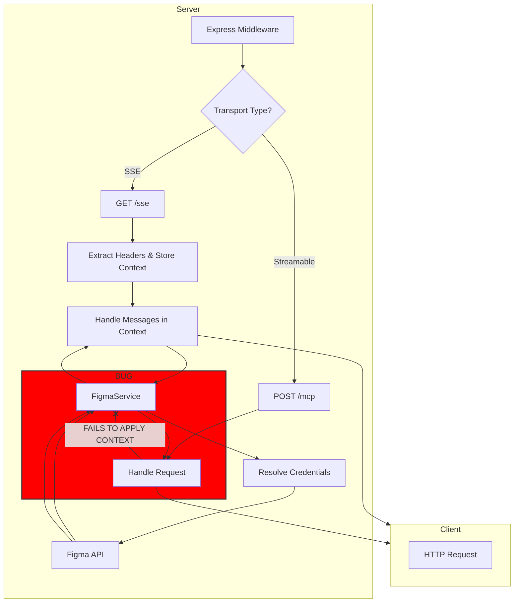

# Figma MCP Server: Architecture Analysis

This document provides a definitive analysis of the Figma MCP Server's architecture. It covers the application's entry point, configuration, dual-mode operation, and the specific mechanisms for handling multi-tenant authentication.

---

## 1. Application Entry Point and Operating Modes

The server's execution is initiated via `src/cli.ts`, which is defined as the binary entry point in `package.json`. This script is responsible for a critical initial decision: selecting the server's operating mode.

The mode is determined by the `isStdioMode` flag:
```typescript
const isStdioMode = process.env.NODE_ENV === "cli" || process.argv.includes("--stdio");
```

- **Stdio Mode (Single-Tenant):** Activated by `NODE_ENV=cli` or the `--stdio` flag. In this mode, the server communicates over standard input/output, suitable for integration as a subprocess within a single-user tool like an IDE. Authentication credentials must be provided at startup.

- **HTTP Mode (Multi-Tenant):** The default mode. The server runs as a persistent HTTP service, capable of handling requests from multiple clients simultaneously. This mode enables a multi-tenant architecture where authentication is handled on a per-request basis.

---

## 2. Configuration Hierarchy

Configuration is managed by `src/config.ts` and sourced with the following priority:

1.  **Command-Line Arguments:** Highest priority (e.g., `--figma-api-key`, `--port`).
2.  **Environment Variables:** Sourced from a `.env` file. A custom path can be provided via the `--env` argument.
3.  **Default Values:** Lowest priority (e.g., `port: 3333`).

---

## 3. Multi-Tenant Architecture & Authentication Flow

The server's ability to support multiple users in HTTP mode is its most critical architectural feature. This is achieved through a combination of per-request context and a clear credential hierarchy.

### a. Per-Request Context with `AsyncLocalStorage`

The core of the multi-tenant design is `AsyncLocalStorage`, implemented in `src/context.ts`. This Node.js feature creates a request-scoped storage, allowing the server to hold unique context (including authentication credentials) for each concurrent request without passing it down the entire call stack.

### b. Credential Extraction and Priority

The `FigmaService` (`src/services/figma.ts`) is the sole component responsible for making requests to the Figma API. Its `request` method implements a strict credential priority:

1.  **Request-Scoped Credentials:** It first attempts to get credentials from the current `RequestContext` (via `getCurrentContext()`). These are credentials that were extracted from the incoming HTTP request's headers (`x-figma-api-key` or `x-figma-oauth-token`).
2.  **Server Base Credentials:** If no request-scoped credentials exist, it falls back to the base credentials that the server was started with (from CLI args or `.env`).
3.  **Error:** If no credentials are found, the request fails.

This ensures that in a multi-tenant environment, each user's request is authenticated with their own token, providing perfect isolation.

### c. HTTP Transport Implementation (`src/server.ts`)

The HTTP server uses Express.js and supports two MCP transport protocols. The handling of context differs between them, revealing a potential bug.

- **Server-Sent Events (SSE):**
    - **Connection (`GET /sse`):** When a client establishes an SSE connection, the server extracts Figma credentials from the headers and stores them in a `RequestContext` object associated with that specific connection.
    - **Messages (`POST /messages`):** For every message received on that connection, the server retrieves the stored `RequestContext` and wraps the message handler in `requestContextStorage.run(...)`. **This correctly applies the per-request context.**

- **Streamable HTTP (`POST /mcp`):**
    - This endpoint handles MCP requests over a single POST endpoint.
    - **CRITICAL FLAW:** The request handler for this endpoint **fails to wrap its logic** in `requestContextStorage.run(...)`. As a result, credentials sent in the headers of a Streamable HTTP request are **never applied**. The service will always fall back to the server's base credentials, breaking the multi-tenant model for this transport. This is a bug.

### d. Architectural Diagram (HTTP Mode Flow)



---

## 4. Core Logic and Services

- **MCP Server (`src/mcp.ts`):** This file initializes the `McpServer` instance and registers the tools available to clients.
    - `get_figma_data`: Fetches file/node structure from Figma.
    - `download_figma_images`: Downloads image assets from Figma.

- **Figma Service (`src/services/figma.ts`):** This is the service layer that encapsulates all communication with the Figma API. It uses the credential resolution logic described above to authenticate its requests.

---

## 5. Dockerization

The project includes a `Dockerfile` and Docker Compose files for containerization, indicating a production-oriented setup.

- **`Dockerfile`:** Uses a standard multi-stage build pattern. It copies package manifests, installs dependencies using `pnpm` (as required by `pnpm-lock.yaml`), builds the TypeScript source, and then copies the compiled output into a minimal final image.
- **`docker-compose.dev.yml`:** Configured for development. It mounts the source code as a volume, enabling hot-reloading, and loads environment variables from the `.env` file.
- **`run-docker.sh`:** A simple script to build and run the development container using Docker Compose.

The Docker setup is sound and follows best practices for both development and production builds.
